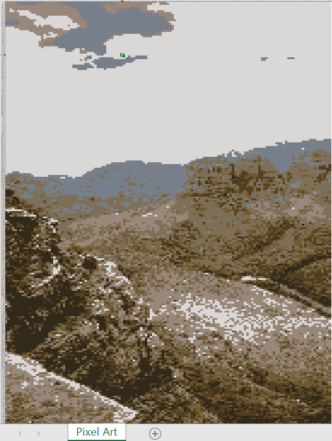

# Pixel Art Generator | 像素画生成器

[English](#english) | [中文](#中文)

---

## English

A full-stack web application built with Node.js that allows users to upload images and instantly generate pixelated versions with customizable parameters (color depth, block size). Export your creations as PNG images or Excel spreadsheets!

### ✨ Features

#### 📤 Image Upload
- Drag & drop support
- Click to select files
- Supports common image formats (JPG, PNG, GIF, WebP, TIFF, SVG, AVIF, HEIC)
- Maximum file size: 10MB

#### 🎨 Customizable Parameters

**Color Depth Options:**
- **Rainbow 7 Colors** - Fixed palette of 9 colors (red, orange, yellow, green, blue, indigo, violet + black & white) for unique artistic style
- **Engraving Intaglio** - Black & white only, dark areas become black, light areas become white (traditional intaglio effect)
- **Engraving Relief** - Black & white only, dark areas become white, light areas become black (traditional relief effect)
- **8 Colors** - Minimalist style, perfect for retro pixel art
- **16 Colors** - Classic retro game style
- **32 Colors** - Balanced color richness and pixelation effect
- **128 Colors** - More color details
- **256 Colors** - Richest color representation

**Block Size Options:**
- **8×8** - Fine pixelation
- **16×16** - Medium pixelation
- **32×32** - Strong pixelation effect

#### 💾 Export Options
- **Download as PNG** - Save your pixel art as an image file
- **Export to Excel** - Generate .xlsx files where each pixel becomes a colored cell, perfect for spreadsheet art!
  
  

#### 🌐 Multi-Language Support
- Available in Chinese (简体中文) and English
- One-click language switching
- Language preference saved automatically

#### 👁️ Real-time Preview
- Side-by-side comparison of original and pixelated images
- Instant processing feedback

### 🛠️ Tech Stack

- **Frontend**: HTML5, CSS3, JavaScript (ES6+)
- **Backend**: Node.js, Express.js
- **Image Processing**: Sharp
- **File Upload**: Multer
- **Excel Generation**: ExcelJS
- **Color Quantization**: quantize

### 📋 Requirements

- Node.js v14 or higher
- npm package manager
- Modern web browser (Chrome, Edge, Firefox recommended)

### 🚀 Installation & Running

1. Make sure Node.js and npm are installed
2. Clone or download the project files
3. Open terminal/command prompt in the project root directory
4. Install dependencies:

```bash
npm install
```

5. Start the server:

```bash
npm start
```

6. Open your browser and visit `http://127.0.0.1:4000`

### 📖 Usage Guide

1. **Upload Image**: Click "Select File" button or drag an image to the upload area
2. **Choose Parameters**: Set color depth and block size
3. **Generate**: Click "Generate Pixel Art" button
4. **Preview**: View the generated result and compare with the original
5. **Export**: 
   - Click "Download Image" to save as PNG
   - Click "Export Excel" to save as .xlsx with colored cells
6. **Switch Language**: Click the 🌐 button in the top-right corner

### 🔌 API Endpoints

- `GET /` - Main page
- `POST /api/pixelate` - Image processing endpoint
  - Parameters:
    - `file` (required): Image file
    - `colors` (optional): Color depth, default 16
    - `blockSize` (optional): Block size, default 8
- `POST /api/export-excel` - Excel export endpoint
  - Parameters:
    - `file` (required): Image file
    - `colors` (optional): Color depth, default 16
    - `blockSize` (optional): Block size, default 8
  - Returns: .xlsx file with colored cells

### 📁 Project Structure

```
pixel-art-generator/
├── public/                 # Frontend static files
│   ├── index.html         # Main page
│   ├── style.css          # Stylesheet
│   ├── script.js          # Frontend logic
│   └── lang.js            # Multi-language support
├── test/                   # Test suite
│   ├── *.md               # Test reports
│   ├── *.js               # Test scripts
│   └── *.png              # Test output images
├── karpathy-guidelines/    # Development guidelines
│   └── SKILL.md           # Coding best practices
├── server.js              # Backend server
├── package.json           # Project dependencies
├── deploy.bat             # Windows deployment script
└── README.md              # This file
```

### 🧪 Testing

All test scripts, outputs, and reports are located in the `test/` folder.

```bash
# Navigate to test folder
cd test

# Run individual tests
node test_algorithm.js        # Basic algorithm test
node test_8_colors.js         # 8-color feature test
node test_rainbow.js          # Rainbow 7-color test
node test_engraving.js        # Engraving feature test
node final_test.js            # Complete test suite

# View test reports
cat TEST_REPORT.md            # Comprehensive test report
cat FINAL_SUMMARY.md          # Issue fix summary
```

For detailed testing instructions, see [test/README.md](test/README.md)

### 🌍 Deployment

```bash
# Deploy to server
npm run deploy

# Or use Windows script
deploy.bat
```

### ⚠️ Notes

- Uploaded images must not exceed 10MB
- Processing may take a few seconds depending on image size
- If you encounter issues, check browser console and server logs
- For transparent backgrounds, use PNG or WebP format
- Recommended resolution: under 4000×4000 pixels

### 📄 License

MIT License

### 🤝 Contributing

Contributions are welcome! Please feel free to submit issues and pull requests.

---

## 中文

一个基于 Node.js 的全栈 Web 应用程序，允许用户上传图像并即时生成具有可定制参数（颜色深度、块大小）的像素化版本。支持将作品导出为 PNG 图片或 Excel 电子表格！

### ✨ 功能特性

#### 📤 图片上传
- 支持拖拽上传
- 支持点击选择文件
- 支持常见图片格式（JPG, PNG, GIF, WebP, TIFF, SVG, AVIF, HEIC）
- 最大文件大小：10MB

#### 🎨 参数自定义

**色彩位数选项：**
- **彩虹7色** - 固定使用红橙黄绿蓝靛紫+黑白9种颜色，创造独特色彩风格
- **版画阴刻** - 仅黑白两色，深色区域变黑，浅色区域变白（传统版画凹陷效果）
- **版画阳刻** - 仅黑白两色，深色区域变白，浅色区域变黑（传统版画凸起效果）
- **8色** - 极简风格，适合复古像素艺术
- **16色** - 经典复古游戏风格
- **32色** - 平衡色彩丰富度和像素化效果
- **128色** - 更多色彩细节
- **256色** - 最丰富的色彩表现

**像素块大小选项：**
- **8×8** - 精细像素化
- **16×16** - 中等像素化
- **32×32** - 强烈像素化效果

#### 💾 导出选项
- **下载为 PNG** - 将像素画保存为图片文件
- **导出为 Excel** - 生成 .xlsx 文件，每个像素对应一个着色单元格，非常适合电子表格艺术！

  

#### 🌐 多语言支持
- 支持中文（简体中文）和英文
- 一键切换语言
- 自动保存语言偏好

#### 👁️ 实时预览
- 原图与像素画并排对比
- 即时处理反馈

### 🛠️ 技术栈

- **前端**: HTML5, CSS3, JavaScript (ES6+)
- **后端**: Node.js, Express.js
- **图片处理**: Sharp
- **文件上传**: Multer
- **Excel 生成**: ExcelJS
- **颜色量化**: quantize

### 📋 系统要求

- Node.js v14 或更高版本
- npm 包管理器
- 现代浏览器（推荐 Chrome、Edge、Firefox）

### 🚀 安装和运行

1. 确保已安装 Node.js 和 npm
2. 克隆或下载项目文件
3. 在项目根目录打开终端/命令行
4. 安装依赖：

```bash
npm install
```

5. 启动服务器：

```bash
npm start
```

6. 打开浏览器，访问 `http://127.0.0.1:4000`

### 📖 使用说明

1. **上传图片**：点击"选择文件"按钮或拖拽图片到上传区域
2. **选择参数**：设定色彩深度和像素块大小
3. **生成**：点击"生成像素画"按钮
4. **预览**：查看生成结果并与原图对比
5. **导出**：
   - 点击"下载图片"保存为 PNG
   - 点击"导出Excel"保存为带有着色单元格的 .xlsx 文件
6. **切换语言**：点击右上角的 🌐 按钮

### 🔌 API 接口

- `GET /` - 主页
- `POST /api/pixelate` - 图像处理接口
  - 参数：
    - `file` (必填): 图片文件
    - `colors` (可选): 色彩深度，默认 16
    - `blockSize` (可选): 像素块大小，默认 8
- `POST /api/export-excel` - Excel 导出接口
  - 参数：
    - `file` (必填): 图片文件
    - `colors` (可选): 色彩深度，默认 16
    - `blockSize` (可选): 像素块大小，默认 8
  - 返回：带有着色单元格的 .xlsx 文件

### 📁 项目结构

```
pixel-art-generator/
├── public/                 # 前端静态文件
│   ├── index.html         # 主页面
│   ├── style.css          # 样式文件
│   ├── script.js          # 前端脚本
│   └── lang.js            # 多语言支持
├── test/                   # 测试文件夹
│   ├── *.md               # 测试报告
│   ├── *.js               # 测试脚本
│   └── *.png              # 测试输出图片
├── karpathy-guidelines/    # 开发指南
│   └── SKILL.md           # 编码最佳实践
├── server.js              # 后端服务器
├── package.json           # 项目依赖
├── deploy.bat             # Windows部署脚本
└── README.md              # 本说明文件
```

### 🧪 测试

所有测试脚本、测试输出和测试报告都位于 `test/` 文件夹中。

```bash
# 进入测试文件夹
cd test

# 运行单个测试
node test_algorithm.js        # 基础算法测试
node test_8_colors.js         # 8色功能测试
node test_rainbow.js          # 彩虹7色测试
node test_engraving.js        # 版画功能测试
node final_test.js            # 完整测试套件

# 查看测试报告
cat TEST_REPORT.md            # 综合测试报告
cat FINAL_SUMMARY.md          # 问题修复总结
```

详细测试说明请查看 [test/README.md](test/README.md)

### 🌍 部署

```
# 部署到服务器
npm run deploy

# 或者使用Windows脚本
deploy.bat
```

### ⚠️ 注意事项

- 上传的图片大小不能超过 10MB
- 生成过程可能需要几秒钟，请耐心等待
- 如果遇到问题，请检查浏览器控制台和服务器日志
- 需要透明背景时，请使用 PNG 或 WebP 格式
- 建议分辨率：4000×4000 像素以内

### 📄 许可证

MIT License

### 🤝 贡献

欢迎贡献代码！请随时提交问题和拉取请求。

---

**Made with ❤️ using Node.js & Sharp**  
**使用 Node.js & Sharp 构建 ❤️**